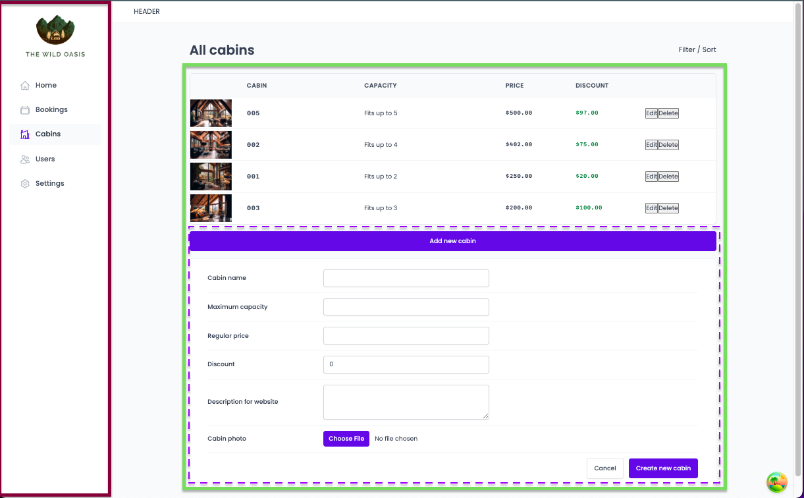

# the-wild-oasis

# React Router with data loading

# Adding Redux and advanced React Router

# Styled Components

# creating a database with Supabase

- Modeling Application State
- Creating Tables
- Relationships between tables
- adding security policies RLS
- Setting up storage buckets

# React Query: Managaning remote state

[datefns](https://date-fns.org/docs/Getting-Started)

