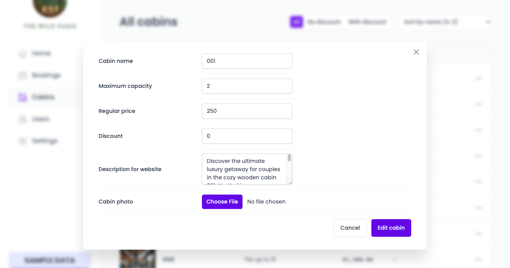
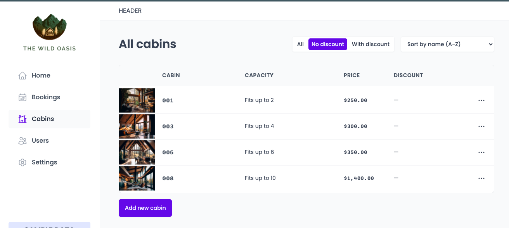
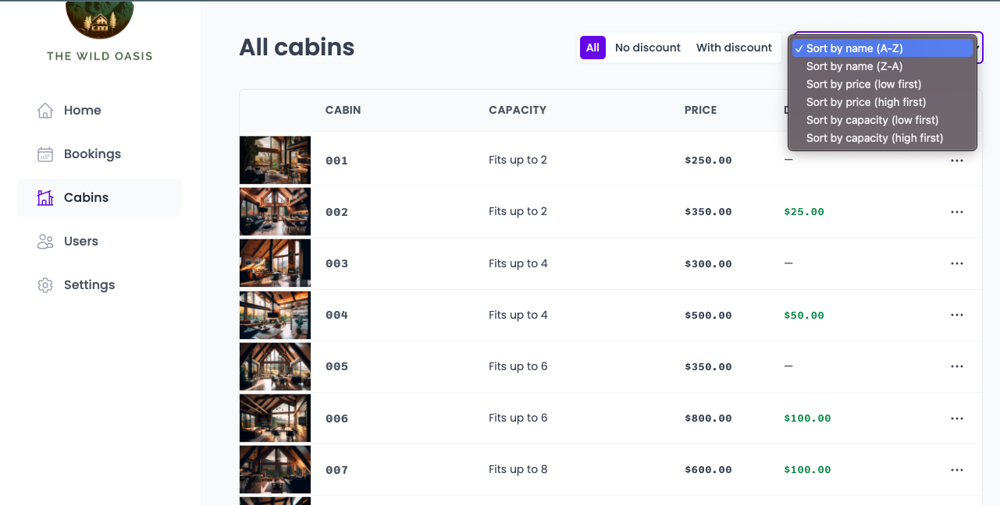

# The Wild Oasis

A comprehensive project combining modern web development technologies and tools to create a full-featured application.

---

## Table of Contents

1. [Overview](#overview)
2. [Technologies Used](#technologies-used)
3. [Features](#features)
4. [Directory Structure](#directory-structure)
5. [Setup Instructions](#setup-instructions)
6. [Modules and Key Concepts](#modules-and-key-concepts)
   - [React Router with Data Loading](#react-router-with-data-loading)
   - [Adding Redux and Advanced React Router](#adding-redux-and-advanced-react-router)
   - [Styled Components](#styled-components)
   - [Creating a Database with Supabase](#creating-a-database-with-supabase)
   - [React Query: Managing Remote State](#react-query-managing-remote-state)
7. [Additional Resources](#additional-resources)

---

## Overview

The Wild Oasis project is a feature-rich web application leveraging React, Redux, Supabase, and other modern tools to create an engaging and efficient user experience. This application includes dynamic routing, state management, and a custom database backend.

---

## Technologies Used

- **React**: Component-based UI development.
- **React Router**: Advanced routing with data loading.
- **Redux**: State management for complex interactions.
- **Styled Components**: CSS-in-JS for scalable and maintainable styling.
- **Supabase**: Backend services for database, authentication, and storage.
- **React Query**: Remote state management and data fetching.
- **Vite**: Fast build tool and development server.

---

## Features

- User authentication and profile management.
- Dynamic and nested routing.
- Database interactions for bookings, cabins, and guests.
- Secure and scalable storage solutions.
- Custom charts and dashboard layouts.
- Responsive design for all devices.

---

## Directory Structure

```plaintext
└── gah-code-the-wild-oasis/
    ├── README.md
    ├── LICENSE
    ├── eslint.config.js
    ├── index.html
    ├── package.json
    ├── vite.config.js
    ├── public/
    └── src/
        ├── App.css
        ├── App.jsx
        ├── main.jsx
        ├── assets/
        ├── data/
        │   ├── Uploader.jsx
        │   ├── data-bookings.js
        │   ├── data-cabins.js
        │   ├── data-guests.js
        │   ├── cabins/
        │   └── img/
        ├── features/
        │   ├── authentication/
        │   │   ├── LoginForm.jsx
        │   │   ├── SignupForm.jsx
        │   │   ├── UpdatePasswordForm.jsx
        │   │   ├── UpdateUserDataForm.jsx
        │   │   └── UserAvatar.jsx
        │   ├── bookings/
        │   │   ├── BookingDataBox.jsx
        │   │   ├── BookingDetail.jsx
        │   │   ├── BookingRow.jsx
        │   │   ├── BookingTable.jsx
        │   │   └── BookingTableOperations.jsx
        │   ├── cabins/
        │   │   ├── CabinRow.jsx
        │   │   ├── CabinTable.jsx
        │   │   ├── CreateCabinForm.jsx
        │   │   ├── useCabins.js
        │   │   ├── useCreateCabin.js
        │   │   ├── useDeleteCabin.js
        │   │   └── useEditCabin.js
        │   ├── check-in-out/
        │   │   ├── CheckinBooking.jsx
        │   │   ├── CheckoutButton.jsx
        │   │   ├── TodayActivity.jsx
        │   │   └── TodayItem.jsx
        │   ├── dashboard/
        │   │   ├── DashboardBox.jsx
        │   │   ├── DashboardFilter.jsx
        │   │   ├── DashboardLayout.jsx
        │   │   ├── DurationChart.jsx
        │   │   ├── SalesChart.jsx
        │   │   └── Stat.jsx
        │   └── settings/
        │       ├── UpdateSettingsForm.jsx
        │       ├── useSettings.js
        │       └── useUpdateSetting.js
        ├── hooks/
        │   ├── useLocalStorageState.js
        │   └── useMoveBack.js
        ├── pages/
        │   ├── Account.jsx
        │   ├── Bookings.jsx
        │   ├── Cabins.jsx
        │   ├── Dashboard.jsx
        │   ├── Login.jsx
        │   ├── PageNotFound.jsx
        │   ├── Settings.jsx
        │   └── Users.jsx
        ├── services/
        │   ├── apiBookings.js
        │   ├── apiCabins.js
        │   ├── apiSettings.js
        │   └── supabase.js
        ├── styles/
        │   └── GlobalStyles.js
        ├── ui/
        │   ├── AppLayout.jsx
        │   ├── Button.jsx
        │   ├── ButtonGroup.jsx
        │   ├── ButtonIcon.jsx
        │   ├── ButtonText.jsx
        │   ├── Checkbox.jsx
        │   ├── ConfirmDelete.jsx
        │   ├── DataItem.jsx
        │   ├── Empty.jsx
        │   ├── ErrorFallback.jsx
        │   ├── FileInput.jsx
        │   ├── Filter.jsx
        │   ├── Flag.jsx
        │   ├── Form.jsx
        │   ├── FormRow.jsx
        │   ├── Header.jsx
        │   ├── Heading.jsx
        │   ├── Input.jsx
        │   ├── Logo.jsx
        │   ├── MainNav.jsx
        │   ├── Menus.jsx
        │   ├── Modal.jsx
        │   ├── Pagination.jsx
        │   ├── Row.jsx
        │   ├── Select.jsx
        │   ├── Sidebar.jsx
        │   ├── Spinner.jsx
        │   ├── SpinnerMini.jsx
        │   ├── Table.jsx
        │   ├── TableOperations.jsx
        │   ├── Tag.jsx
        │   └── Textarea.jsx
        └── utils/
            └── helpers.js
```

---

## Setup Instructions

1. Clone the repository:

   ```bash
   git clone https://github.com/your-username/gah-code-the-wild-oasis.git
   ```

2. Navigate to the project directory:

   ```bash
   cd gah-code-the-wild-oasis
   ```

3. Install dependencies:

   ```bash
   npm install
   ```

4. Start the development server:

   ```bash
   npm run dev
   ```

5. Open your browser and navigate to `http://localhost:3000`.

---

## Modules and Key Concepts

### React Router with Data Loading

React Router is used to implement dynamic routing, enabling smooth navigation and efficient data fetching for each route.

### Adding Redux and Advanced React Router

Redux is integrated to manage complex application state, while advanced React Router features allow for nested routes and data-driven navigation.

### Styled Components

Styled Components facilitate a modular approach to styling, allowing for reusable and maintainable CSS-in-JS.

### Creating a Database with Supabase

Supabase provides a fully-featured backend with:

- Table creation and relationships.
- Security policies (RLS) to protect data.
- Storage buckets for managing assets.

### React Query: Managing Remote State

React Query is used for efficient server-state management, ensuring seamless data fetching, caching, and synchronization.

---

## Additional Resources

- [date-fns Documentation](https://date-fns.org/docs/Getting-Started)




