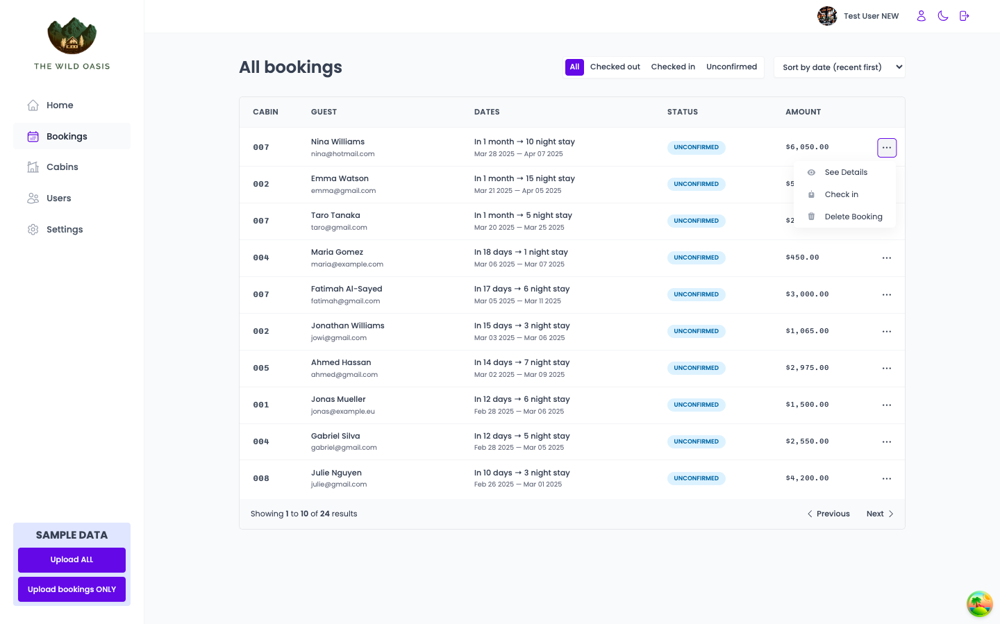
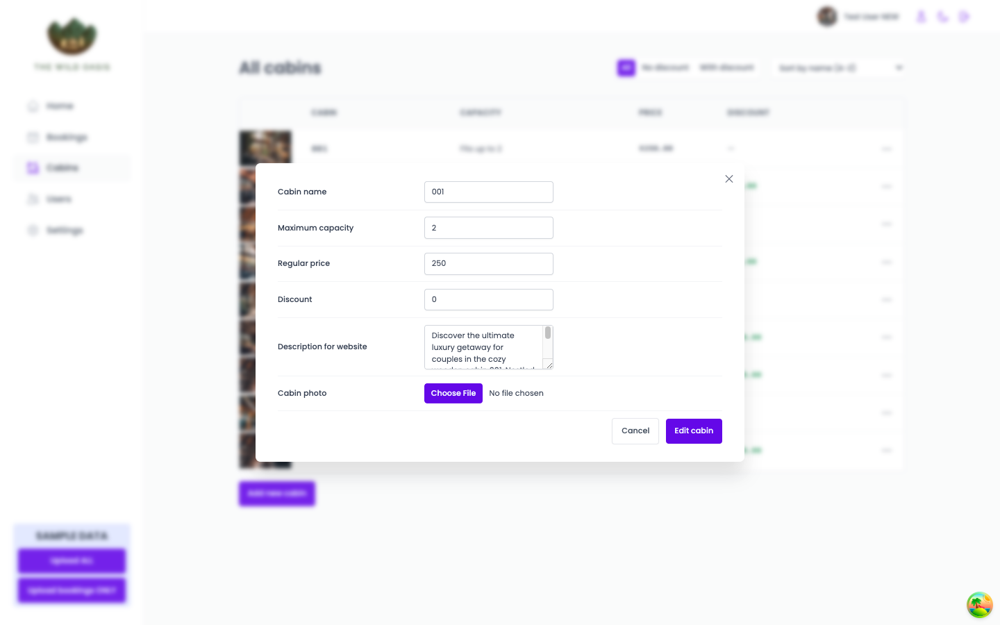

# The Wild Oasis

A comprehensive project combining modern web development technologies and tools to create a full-featured internal hotel management application.

---

## Table of Contents

1. [Overview](#overview)
2. [Technologies Used](#technologies-used)
3. [Features](#features)
4. [Directory Structure](#directory-structure)
5. [Setup Instructions](#setup-instructions)
6. [Modules and Key Concepts](#modules-and-key-concepts)
   - [React Router with Data Loading](#react-router-with-data-loading)
   - [Adding Redux and Advanced React Router](#adding-redux-and-advanced-react-router)
   - [Styled Components](#styled-components)
   - [Creating a Database with Supabase](#creating-a-database-with-supabase)
   - [React Query: Managing Remote State](#react-query-managing-remote-state)
7. [Project Requirements](#project-requirements)
8. [Additional Resources](#additional-resources)

---

## Overview

The Wild Oasis is a boutique hotel with eight luxurious wooden cabins. This project is a custom-built internal management application that allows hotel employees to handle bookings, cabins, and guests. The app is designed with an intuitive UI and robust backend integration to streamline operations.

---

## Technologies Used

- **React**: Component-based UI development.
- **React Router**: Advanced routing with data loading.
- **Redux**: State management for complex interactions.
- **Styled Components**: CSS-in-JS for scalable and maintainable styling.
- **Supabase**: Backend services for database, authentication, and storage.
- **React Query**: Remote state management and data fetching.
- **Vite**: Fast build tool and development server.
- **React Hook Form**: Form management for smooth user interactions.
- **Recharts**: Data visualization library for dashboards.
- **date-fns**: Utility library for handling dates.
- **React Icons & React Hot Toast**: UI enhancements for notifications and icons.

---

## Features

### Authentication

- Only hotel employees can access the application.
- Users must be logged in to perform actions.
- New users can be signed up only inside the application.
- Users can upload an avatar and update their profile information.

### Cabins Management

- View a list of all cabins with details (photo, name, capacity, price, discount).
- Create, update, and delete cabins.
- Upload photos for cabins.

### Bookings Management

- View and manage hotel bookings.
- Filter bookings by status: “unconfirmed,” “checked-in,” “checked-out.”
- Track booking details, including guests, nights, breakfast options, and payment status.

### Check-In / Check-Out

- Check guests in and out with a simple interface.
- Accept payment during check-in and confirm payment status.
- Allow guests to add breakfast for their entire stay upon check-in.

### Guest Management

- Store guest details: full name, email, national ID, nationality, and country flag.

### Dashboard

- View daily check-ins and check-outs.
- Monitor recent bookings, sales, and occupancy rates.
- Visualize hotel performance with sales and stay duration charts.

### Settings

- Configure global settings such as breakfast price, minimum/maximum booking nights, and max guests per booking.
- Enable dark mode for a customizable user experience.

---

## Directory Structure

```plaintext
└── gah-code-the-wild-oasis/
    ├── README.md
    ├── LICENSE
    ├── eslint.config.js
    ├── index.html
    ├── package.json
    ├── vite.config.js
    ├── public/
    └── src/
        ├── App.css
        ├── App.jsx
        ├── main.jsx
        ├── assets/
        ├── data/
        │   ├── Uploader.jsx
        │   ├── data-bookings.js
        │   ├── data-cabins.js
        │   ├── data-guests.js
        │   ├── cabins/
        │   └── img/
        ├── features/
        │   ├── authentication/
        │   │   ├── LoginForm.jsx
        │   │   ├── SignupForm.jsx
        │   │   ├── UpdatePasswordForm.jsx
        │   │   ├── UpdateUserDataForm.jsx
        │   │   └── UserAvatar.jsx
        │   ├── bookings/
        │   │   ├── BookingDataBox.jsx
        │   │   ├── BookingDetail.jsx
        │   │   ├── BookingRow.jsx
        │   │   ├── BookingTable.jsx
        │   │   └── BookingTableOperations.jsx
        │   ├── cabins/
        │   │   ├── CabinRow.jsx
        │   │   ├── CabinTable.jsx
        │   │   ├── CreateCabinForm.jsx
        │   │   ├── useCabins.js
        │   │   ├── useCreateCabin.js
        │   │   ├── useDeleteCabin.js
        │   │   └── useEditCabin.js
        │   ├── check-in-out/
        │   │   ├── CheckinBooking.jsx
        │   │   ├── CheckoutButton.jsx
        │   │   ├── TodayActivity.jsx
        │   │   └── TodayItem.jsx
        │   ├── dashboard/
        │   │   ├── DashboardBox.jsx
        │   │   ├── DashboardFilter.jsx
        │   │   ├── DashboardLayout.jsx
        │   │   ├── DurationChart.jsx
        │   │   ├── SalesChart.jsx
        │   │   └── Stat.jsx
        │   └── settings/
        │       ├── UpdateSettingsForm.jsx
        │       ├── useSettings.js
        │       └── useUpdateSetting.js
        ├── hooks/
        │   ├── useLocalStorageState.js
        │   └── useMoveBack.js
        ├── pages/
        │   ├── Account.jsx
        │   ├── Bookings.jsx
        │   ├── Cabins.jsx
        │   ├── Dashboard.jsx
        │   ├── Login.jsx
        │   ├── PageNotFound.jsx
        │   ├── Settings.jsx
        │   └── Users.jsx
        ├── services/
        │   ├── apiBookings.js
        │   ├── apiCabins.js
        │   ├── apiSettings.js
        │   └── supabase.js
        ├── styles/
        │   └── GlobalStyles.js
        ├── ui/
        │   ├── AppLayout.jsx
        │   ├── Button.jsx
        │   ├── ButtonGroup.jsx
        │   ├── ButtonIcon.jsx
        │   ├── ButtonText.jsx
        │   ├── Checkbox.jsx
        │   ├── ConfirmDelete.jsx
        │   ├── DataItem.jsx
        │   ├── Empty.jsx
        │   ├── ErrorFallback.jsx
        │   ├── FileInput.jsx
        │   ├── Filter.jsx
        │   ├── Flag.jsx
        │   ├── Form.jsx
        │   ├── FormRow.jsx
        │   ├── Header.jsx
        │   ├── Heading.jsx
        │   ├── Input.jsx
        │   ├── Logo.jsx
        │   ├── MainNav.jsx
        │   ├── Menus.jsx
        │   ├── Modal.jsx
        │   ├── Pagination.jsx
        │   ├── Row.jsx
        │   ├── Select.jsx
        │   ├── Sidebar.jsx
        │   ├── Spinner.jsx
        │   ├── SpinnerMini.jsx
        │   ├── Table.jsx
        │   ├── TableOperations.jsx
        │   ├── Tag.jsx
        │   └── Textarea.jsx
        └── utils/
            └── helpers.js
```

---

## Interface

## Home Page - Dashboard


### Dark Mode


## Booking Page



### Booking Details


## Cabins Page


### Edit



### Create


## Create User


### Profile


## Settings


---

## Setup Instructions

1. Clone the repository:

   ```bash
   git clone https://github.com/your-username/gah-code-the-wild-oasis.git
   ```

2. Navigate to the project directory:

   ```bash
   cd gah-code-the-wild-oasis
   ```

3. Install dependencies:

   ```bash
   npm install
   ```

4. Start the development server:

   ```bash
   npm run dev
   ```

5. Open your browser and navigate to `http://localhost:3000`.

---

## Modules and Key Concepts

### React Router with Data Loading

- Enables dynamic routing and data-driven navigation.

### Redux and Advanced React Router

- Manages complex application state and enhances routing features.

### Styled Components

- Provides modular styling solutions for a scalable UI.

### Supabase for Database & Authentication

- Manages user authentication, data storage, and security policies.

### React Query for Remote State Management

- Optimizes server-state management with caching and background updates.

---

## Additional Resources

- [date-fns Documentation](https://date-fns.org/docs/Getting-Started)
